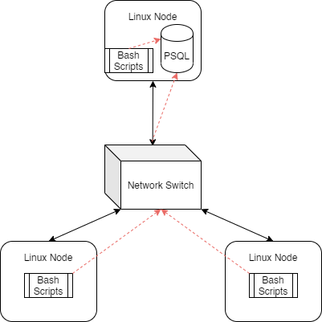

# Linux Cluster Monitoring Agent
This project is under development. Since this project follows the GitFlow, the final work will be merged to the main branch.

## Introduction
The `Linux Cluster Monitoring Agent (LCMA)` is a cluster monitoring software tool created for the Linux Cluster Administration (LCA) team. The tool's purpose is to manage and record hardware specifications and resource usage of their Linux clusters. The LCMA project was tested on a `Jarvis Virtual Machine`, created and hosted by a `Google Cloud Platform`. Each server is internally connected through a switch that enables them to communicate through an internal IPv4 address. The appropriate data are collected and recorded in a container `Relational Database Management System (RDBMS)` in real-time for the LCA team to generate reports for future resource planning purposes. In addition, `crontab` was implemented as a monitor agent to acquire usage of each node in the network every minute.

Finally, the hardware and usage data were tested using a `Docker PostgresSQL container` using a postgres:9.6-alpine image. Each script was developed in Jarvis Virtual Machine using `IntelliJ IDEA` as `Integrated Development Environment(IDE)`. Used `Git` for `version control` and the source codes were uploaded to `GitHub` utilizing a `Secure Shell Protocol(SSH)` connection.

The following technologies were used:
- `Linux (Centos 7)`
- `Bash`
- `Git / Github`
- `Docker`
- `Postgres SQL`
- `Google Cloud Platform`
- `Crontab`

## Quick Start
- Start a psql instance using `psql_docker.sh`
```bash
# Create a PSQL docker container with the given username and password

# Print error if username/password is not given or the container already exist
./scripts/psql_docker.sh create [db_username][db_password]

# Start the PSQL docker container
./scripts/psql_docker.sh start 

# Stop the running PSQL docker container
./scripts/psql_docker.sh stop 
```
- Create tables using `ddl.sql`
```bash
psql -h localhost -U postgres -d host_agent -f sql/ddl.sql
```
- Insert hardware specs data into the DB using `host_info.sh`
```bash
./scripts/host_info.sh [host] [port] [database] [username] [password]
```
- Insert hardware usage data into the DB using `host_usage.sh`
```bash
./scripts/host_usage.sh [host] [port] [database] [username] [password]
```
- `Crontab` Setup 
```bash
# Edit crontab jobs
crontab -e

# Add this to crontab
* * * * * bash ./scripts/host_usage.sh localhost 5432 host_agent postgres password > /tmp/host_usage.log
```
## Architecture Diagram


Each Linux node is connected through a switch. One node has the PSQL instance, and thus can send the results from its scripts directly to it. The other nodes must send their results through the switch to get to the database.

## Database Modeling
The `host_agent` database contains two tables:

The `host_info` table contains hardware specifications for the host 

| Field            | Description                                     |
|------------------|-------------------------------------------------|
| id               | Auto-incremented unique identifier for the host |
| hostname         | 	The name for the host, also needs to be unique |
| cpu_number       | 	The number of cores the CPU has                |
| cpu_architecture | 	The architecture of the CPU                    |
| cpu_model        | 	The name of the CPU model                      |
| cpu_mhz          | 	The clock speed of the CPU, in MHz             |
| L2_cache         | 	The size of the L2 cache, in KB                |
| total_mem        | 	The total amount of memory in the node         |
|  timestamp       | 	When these specifications were taken           |

The `host_usage` table contains usage statistics for the host

| Field	          | Description                                            |
|-----------------|--------------------------------------------------------|
| timestamp	      | When these statistics were taken                       |
| host_id	        | The ID of the corresponding host_info entry            |
| memory_free	    | The amount of free memory in the node                  |
| cpu_idle	       | The percentage of time that the CPU is idle            |
| cpu_kernel	     | The percentage of time the CPU is running kernel code  |
| disk_io	        | The number of disks currently undergoing I/O processes |
| disk_available	 | Available space in the disk's root directory in MB     |

## Scripts
The `psql_docker.sh` script manages the PSQL Docker instance
```bash
# Provisions and starts a PSQL Docker instance, creating the specified user within
./scripts/psql_docker.sh create [db_username] [db_password]

# Start/stop the Docker instance
./scripts/psql_docker.sh [start | stop]
# Need to ensure the Docker instance has be created
```
The `ddl.sql` script handles creating the database tables needed for the agent
```bash
# Create the host_info and host_usage tables in the host_agent database
psql -h localhost -U [db_username] -d host_agent -f sql/ddl.sql
# db_password required, also assumes host_agent database already exists
# Docker instance needs to be running
```
The `host_info.sh` script gets host hardware specifications and adds to the database
```bash
# Get hardware specifications and insert them into the host_info table
./scripts/host_info.sh [psql host] [port] host_agent [db_username] [db_password]
# Where:
# psql host is the connection to the PSQL instance
# port is the port to connect to
# db_username/password are from the user created along the instance
# Assumes that the host_info table already exists within the host_agent database
# Docker instance needs to be running
# Only needs to be ran once per host
```
The `host_usage.sh` script gets host usage statistics and adds them to the database
```bash
# Get usage statistics and insert them into the host_usage table
./scripts/host_usage.sh [psql host] [port] host_agent [db_username] [db_password]
# Where:
# psql host is the connection to the PSQL instance
# port is the port to connect to
# db_username/password are from the user created along the instance
# Assumes that the host_usage table already exists within the host_agent database
# Docker instance needs to be running
# Should be run multiple times for continuous updates
# Can automate host_usage using crontab jobs
```
The `crontab` setup
```bash
crontab -e
# In the editor which opens, add the line below to collect usage statistics every minute
* * * * * bash [full/path/to]/linux_sql/scripts/host_usage.sh [psql host] [port] host_agent [db_username] [db_password] &> /tmp/host_usage.log
# Can ensure job is running using
crontab -l
# Results are logged in /tmp/host_usage.log
```
## Future Improvements
- Devise a way to keep hardware specifications up to date
- Run host_usage.sh script when the usage is over a limit to monitor the system more efficient
- Transfer the data from table format into graph to make the result more readable