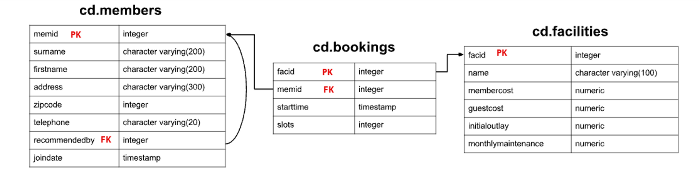

# Introduction
This is a learning project which allows you to learn SQL and RDBMS by solving SQL queries.
- Setup and start a PSQL instance using `docker`
- Install and setup `dbeaver` as SQL IDE
- Write SQL DDL statements to create the following tables (PK is primary key; FK is foreign key)
  
- Load sample data `clubdata.sql` into database 
```bash
psql -h localhost -U postgres -d postgres -f clubdata.sql -x -q
```
- Solve all SQL exercise questions below

# SQL Quries

###### Table Setup (DDL)
```sql
CREATE TABLE cd.members
    (
       memid integer NOT NULL, 
       surname character varying(200) NOT NULL, 
       firstname character varying(200) NOT NULL, 
       address character varying(300) NOT NULL, 
       zipcode integer NOT NULL, 
       telephone character varying(20) NOT NULL, 
       recommendedby integer,
       joindate timestamp NOT NULL,
       CONSTRAINT members_pk PRIMARY KEY (memid),
       CONSTRAINT fk_members_recommendedby FOREIGN KEY (recommendedby)
            REFERENCES cd.members(memid) ON DELETE SET NULL
    );

CREATE TABLE cd.facilities
(
    facid integer NOT NULL,
    name character varying(100) NOT NULL,
    membercost numeric NOT NULL,
    guestcost numeric NOT NULL,
    initialoutlay numeric NOT NULL,
    monthlymaintenance numeric NOT NULL,
    CONSTRAINT facilities_pk PRIMARY KEY (facid)
);

CREATE TABLE cd.bookings
(
    bookid integer NOT NULL,
    facid integer NOT NULL,
    memid integer NOT NULL,
    starttime timestamp NOT NULL,
    slots integer NOT NULL,
    CONSTRAINT bookings_pk PRIMARY KEY (bookid),
    CONSTRAINT fk_bookings_facid FOREIGN KEY (facid) REFERENCES cd.facilities(facid),
    CONSTRAINT fk_bookings_memid FOREIGN KEY (memid) REFERENCES cd.members(memid)
);
```
###### Question 1: The club is adding a new facility - a spa. We need to add it into the facilities table.
```sql
insert into cd.facilities
VALUES
    (9, 'Spa', 20, 30, 100000, 800);
```
###### Question 2: Let's try adding the spa to the facilities table again. This time we want to automatically generate the value for the next facid, rather than specifying it as a constant.
```sql
insert into cd.facilities
    (facid, name, membercost, guestcost, initialoutlay, monthlymaintenance)
select (select max(facid) from cd.facilities )+1, 'Spa', 20, 30, 100000, 800;
```
###### Question 3: We made a mistake when entering the data for the second tennis court. The initial outlay was 10000 rather than 8000
```sql
update
    cd.facilities
set
    initialoutlay = 10000
where
    name = 'Tennis Court 2';
```
###### Question 4: We want to alter the price of the second tennis court so that it costs 10% more than the first one. Try to do this without using constant values for the prices, so that we can reuse the statement if we want to.
```sql
update
    cd.facilities
set
    membercost = (select membercost * 1.1 from cd.facilities where name = 'Tennis Court 1') ,
    guestcost = (select guestcost * 1.1 from cd.facilities where name = 'Tennis Court 1')
where
    name = 'Tennis Court 2';
```
###### Question 5: As part of a clear out of our database, we want to delete all bookings from the cd.bookings table.
```sql
delete from cd.bookings
```
###### Question 6: We want to remove member 37, who has never made a booking, from our database.
```sql
delete from cd.members
where
    memid =37;
```
###### Question 7: How can you produce a list of facilities that charge a fee to members, and that fee is less than 1/50th of the monthly maintenance cost? Return the facid, facility name, member cost, and monthly maintenance of the facilities in question.
```sql
select
    facid,
    name,
    membercost,
    monthlymaintenance
from
    cd.facilities
where
    membercost < monthlymaintenance / 50
    and membercost > 0;
```
###### Question 8: How can you produce a list of all facilities with the word 'Tennis' in their name?
```sql
select
    *
from
    cd.facilities
where
    name like '%Tennis%';
```
###### Question 9: How can you retrieve the details of facilities with ID 1 and 5? Try to do it without using the OR operator.
```sql
select
    *
from
    cd.facilities
where
    facid in (1,5);
```
###### Question 10: How can you produce a list of members who joined after the start of September 2012? Return the memid, surname, firstname, and joindate of the members in question.
```sql
select
    memid,
    surname,
    firstname,
    joindate
from
    cd.members
where
    joindate > '2012-09-01 00:00:00';
```
###### Question 11: You, for some reason, want a combined list of all surnames and all facility names.
```sql
select
    surname
from
    cd.members
union
select
    name
from
    cd.facilities;
```
###### Question 12: How can you produce a list of the start times for bookings by members named 'David Farrell'?
```sql
select
    starttime
from
    cd.bookings b
    join cd.members m
    on b.memid = m.memid
where
    firstname = 'David'
    and surname = 'Farrell';
```
###### Question 13: How can you produce a list of the start times for bookings for tennis courts, for the date '2012-09-21'? Return a list of start time and facility name pairings, ordered by the time.
```sql
select
    starttime,
    name
from
    cd.bookings b
    left join cd.facilities f
    on b.facid =f.facid
where
    starttime >'2012-09-21 00:00:00'
    and starttime < '2012-09-22 00:00:00'
    and name like 'Tennis Court%'
order by
    starttime;
```
###### Question 14: How can you output a list of all members, including the individual who recommended them (if any)? Ensure that results are ordered by (surname, firstname).
```sql
select
    m1.firstname,
    m1.surname,
    m2.firstname,
    m2.surname
from
    cd.members m1
    left join cd.members m2
    on m1.recommendedby = m2.memid
order by
    m1.surname,
    m1.firstname;
```
###### Question 15: How can you output a list of all members who have recommended another member? Ensure that there are no duplicates in the list, and that results are ordered by (surname, firstname).
```sql
select distinct
    m2.firstname as firstname,
    m2.surname as surname
from
    cd.members m1
    join cd.members m2
    on m1.recommendedby = m2.memid
order by
    m2.surname,
    m2.firstname;
```
###### Question 16: How can you output a list of all members, including the individual who recommended them (if any), without using any joins? Ensure that there are no duplicates in the list, and that each firstname + surname pairing is formatted as a column and ordered.
```sql
select distinct
    concat(firstname, ' ',surname) as member,
    (
    select
        concat(firstname, ' ',surname) as recommender
    from
        cd.members m2
    where
        m1.recommendedby = m2.memid
    )
from
    cd.members m1
order by
    1;
```
###### Question 17: Produce a count of the number of recommendations each member has made. Order by member ID.
```sql
select
    recommendedby,
    count(recommendedby)
from
    cd.members
where
    recommendedby is not null
group by
    recommendedby
order by
    recommendedby;
```
###### Question 18: Produce a list of the total number of slots booked per facility. For now, just produce an output table consisting of facility id and slots, sorted by facility id.
```sql
select
    facid,
    sum(slots)
from
    cd.bookings
group by
    facid
order by
    facid;
```
###### Question 19: Produce a list of the total number of slots booked per facility in the month of September 2012. Produce an output table consisting of facility id and slots, sorted by the number of slots.
```sql
select
    facid,
    sum(slots)
from
    cd.bookings
where
    starttime >= '2012-09-01'
    and starttime <'2012-10-01'
group by
    facid
order by
    sum(slots);
```
###### Question 20: Produce a list of the total number of slots booked per facility per month in the year of 2012. Produce an output table consisting of facility id and slots, sorted by the id and month.
```sql
select
    facid,
    extract(month from starttime),
    sum(slots)
from
    cd.bookings
where
    starttime >= '2012-01-01'
    and starttime < '2013-01-01'
group by
    facid,
    extract(month from starttime)
order by
    facid,
    extract(month from starttime);
```
###### Question 21: Find the total number of members (including guests) who have made at least one booking.
```sql
select
    count(distinct memid)
from
    cd.bookings;
```
###### Question 22: Produce a list of each member name, id, and their first booking after September 1st 2012. Order by member ID.
```sql
select
    surname,
    firstname,
    b.memid,
    min(starttime)
from
    cd.bookings b
    left join cd.members m
    on b.memid = m.memid
where
    starttime >= '2012-09-01'
group by
    b.memid,surname,firstname
order by
    b.memid;
```
###### Question 23: Produce a list of member names, with each row containing the total member count. Order by join date, and include guest members.
```sql
select
    count(memid) over (),
    firstname,
    surname
from
    cd.members
order by
    joindate;
```
###### Question 24: Produce a monotonically increasing numbered list of members (including guests), ordered by their date of joining. Remember that member IDs are not guaranteed to be sequential.
```sql
select
    row_number()over(),
    firstname,
    surname
from
    cd.members
order by
    joindate;
```
###### Question 25: Output the facility id that has the highest number of slots booked. Ensure that in the event of a tie, all tieing results get output.
```sql
select
    facid,
    sum
from
    (select
        facid,
        sum(slots) as sum,
        rank()over(order by sum(slots) desc) as rnk
    from
        cd.bookings
    group by
        facid
    ) a
where
    rnk =1;
```
###### Question 26: Output the names of all members, formatted as 'Surname, Firstname'
```sql
select
    concat(surname, ', ', firstname)
from
    cd.members;
-- or
select
    surname || ', ' || firstname as name
from
    cd.members;
```
###### Question 27: You've noticed that the club's member table has telephone numbers with very inconsistent formatting. You'd like to find all the telephone numbers that contain parentheses, returning the member ID and telephone number sorted by member ID.
```sql
select
    memid,
    telephone
from
    cd.members
where
    telephone ~ '[()]';
```
###### Question 28: You'd like to produce a count of how many members you have whose surname starts with each letter of the alphabet. Sort by the letter, and don't worry about printing out a letter if the count is 0.
```sql
select
    substr (mems.surname,1,1) as letter,
    count(*) as count
from
    cd.members mems]
group by
    letter
order by
    letter;
```
	
	
	
	
	
	
	
	
	
	
	
	
	
	
	
	
	
	


